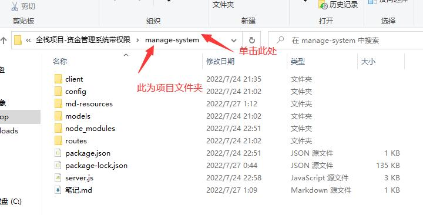
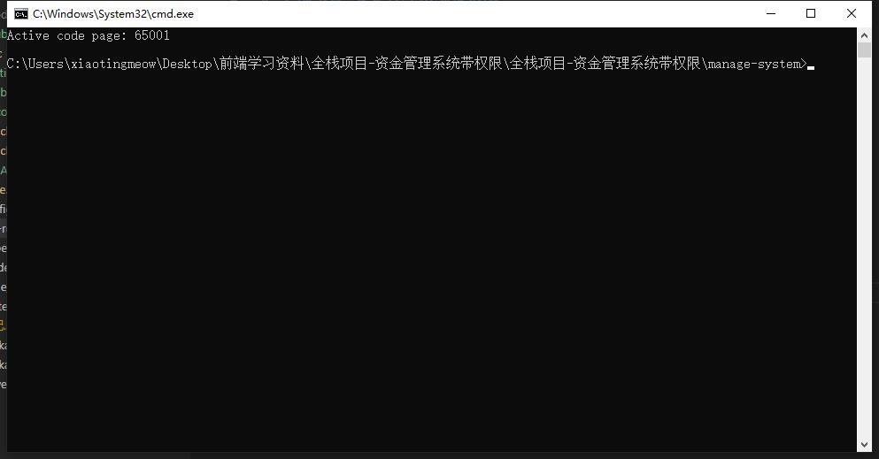
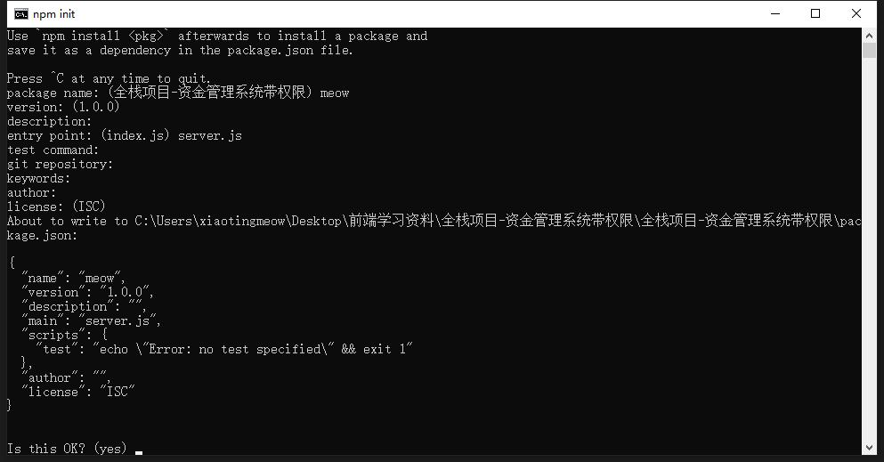
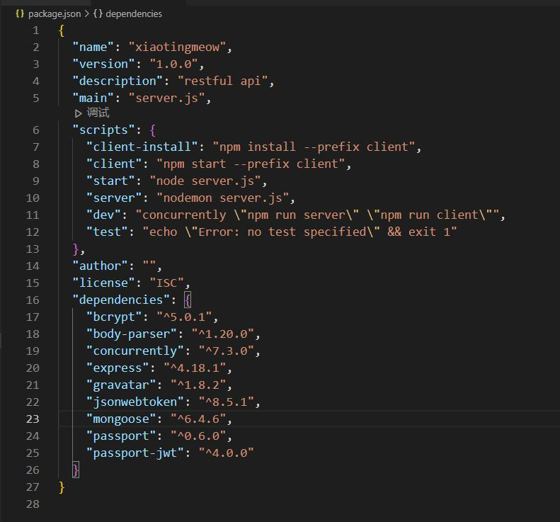
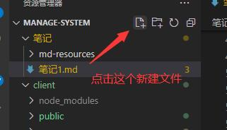
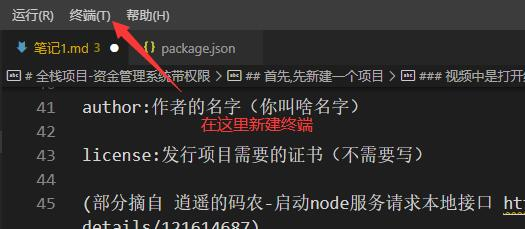

# 全栈项目-资金管理系统带权限

为了防止今后看到就会,写时就废的情况发生,特作此笔记

原项目视频链接:<https://www.bilibili.com/video/BV1R341167Fw>

## 首先,先新建一个项目

新建一个文件夹来存放项目(视频中为node-app)

然后在文件夹中

<>

并输入`cmd`,进入命令行工具

长这样

<>

输入`npm init`,开始配置package.json

.

### 如果`npm init`报错,应该是没有装node.js,如何安装可以看这个 (Node.js安装配置 https://www.runoob.com/nodejs/nodejs-install-setup.html)

package.json是配置和描述如何与程序交互和运行的中心。 npm CLI（和 yarn）用它来识别你的项目并了解如何处理项目的依赖关系。package.json文件使 npm 可以启动你的项目、运行脚本、安装依赖项、发布到 NPM 注册表以及许多其他有用的任务。(摘自 不求人-package.json详解 <https://zhuanlan.zhihu.com/p/433962235>)

.

接下来会有如下选项依次出现`package name,version,description,entry point,test command,git repository,keywords,author,license`(输入完之后,按回车进入下一个)

<>

详解:

package name:项目名字(可选)

version:当前项目版本(可选)

description:项目描述(可选)

entry point:项目的入口文件,视频中使用的是server.js,入口文件不会在本过程中创建,需要自己新建文件,在启动node服务如`node xxx,nodemon xxx`时,会先启动这个文件

test command:项目启动的时候要用什么命令来执行脚本文件（如果留空,默认为node app.js）

git repository:如果你要将项目上传到git中的话，那么就需要填写git的仓库地址（这里就不写地址了）

keywords：项目关键字（不需要写）

author:作者的名字（你叫啥名字）

license:发行项目需要的证书（不需要写）

(部分摘自 逍遥的码农-启动node服务请求本地接口 https://blog.csdn.net/weixin_48171107/article/details/121614687)

然后就生成了一个package.json文件

长这样

<>

打开之后是这样

<>

(看起来不是新建的,其实这是本项目完成的最终形态)

现在先抛开这个文件不管(有了package.json就可以npm装各种包了,会在终端中输入指令)

### 视频中是打开终端输入`touch server.js`,至少我没有成功,还可以用这个办法→

<>

然后进入server.js

现在需要express框架来搭建服务器了(之后再去总结其功能)

在位于package.json文件的目录下,打开cmd或者使用vscode打开终端,如图

<>

出现如图界面

<>

然后输入npm install express,系统会自动下载,等待完成即可

### 如出现下载缓慢请配置npm淘宝镜像(也就是在终端里复制如下语句并回车,之后npm包都会在这网站下载)

### ``` npm config set registry https://registry.npm.taobao.org ``` 

(摘自 尚硅谷Vue2.0+Vue3.0全套教程丨vuejs从入门到精通 P61 5分33秒 https://www.bilibili.com/video/BV1Zy4y1K7SH?p=61)

.

express简介：

Express 是一个简洁而灵活的 node.js Web应用框架, 提供了一系列强大特性帮助你创建各种 Web 应用，和丰富的 HTTP 工具。

使用 Express 可以快速地搭建一个完整功能的网站。

Express 框架核心特性：

可以设置中间件来响应 HTTP 请求。

定义了路由表用于执行不同的 HTTP 请求动作。

可以通过向模板传递参数来动态渲染 HTML 页面。

.

接下来在server.js中输入如下代码

```javascript
//express()用来创建一个Express的程序。express()方法是express模块导出的顶层方法。
const express = require("express");
const app = express();
```

### 现在可以使用express中的各种方法了

注释摘自 @XiangZhou-express 4.x api 中文手册 (https://www.zybuluo.com/XiangZhou/note/208532)

往下输入如下代码

```javascript
//指定端口为环境变量PORT中的内容，如果没有，则为5000
const port = process.env.PORT || 5000;
```

然后往下输入

```javascript
//绑定程序监听端口到指定的主机和端口号。这个方法和Node中的http.Server.listen()是一样的。
app.listen(port, () => {
  console.log(`server running on port ${port}`);
});
```

### 现在已经搭建好服务器了(但还不能访问),它会在终端返回给你正在监听的端口

.

关于process.env.PORT的描述:

在许多环境（例如Heroku）中，作为一种约定，您可以设置环境变量PORT以告知Web服务器要监听的端口。

因此，process.env.PORT || 3000意味着：环境变量PORT中的任何内容，如果没有，则为3000。

因此，您可以将app.listen，或传递给app.set('port', ...)，从而使您的服务器能够从环境中接受要监听的端口上的参数。

如果将3000硬编码传递给app.listen()，则您总是在监听端口3000，这可能只适合您自己，也可能不适合您，具体取决于您的要求和运行服务器的环境的要求.

摘自 编程字典-Node.js中的process.env.PORT是什么？(https://codingdict.com/questions/76797)

.

接下来输入

```javascript
//路由HTTP GET请求到有特殊回调的特殊路径
app.get("/", (req, res) => {
  res.send("hello world");
});

```
### 设置了路由,现在可以访问服务器了

.

GET 方法用来请求访问已被 URI 识别的资源。指定的资源经服务器端解析后返回响应内容。也就是说，如果请求的资源是文本，那就保持原样返回；如果是像 CGI（Common Gateway Interface，通用网关接口）那样的程序，则返回经过执行后的输出结果。

摘自《图解http》（上野宣 著）

.

现在每次改变服务器代码，都需要重新启动服务器(初始操作为`node server.js`开启服务器,`Ctrl+C`键关闭服务器)

在终端输入`npm install nodemon`安装`nodemon`

现在在终端输入`nodemon server.js`,每次保存`server.js`文件,nodemon都会自动重启服务器,不需要重复在终端输入并打开服务器.

回到package.json新增如下语句后

<>

就可以使用如下命令`npm run server`来代替`nodemon server.js`.(同理`npm run start`也可代替`node server.js`)

.

Nodemon是一个帮助开发基于node .js的应用程序的工具，当检测到目录中的文件发生变化时，它会自动重启节点应用程序。

Nodemon不需要对代码或开发方法进行任何额外的更改。Nodemon是node的替代包装器。要使用nodemon，在执行脚本时替换命令行上的单词node。

摘自 nodemon-npm (https://www.npmjs.com/package/nodemon)

.

P1总结:

<>